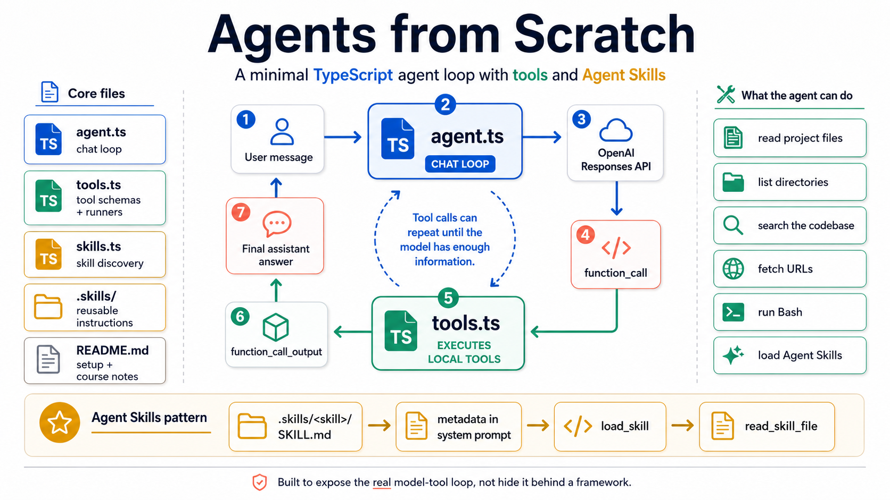

# Agents from Scratch



This repo is an example of trying to code up an AI agent from scratch

## Rules
You are not allowed to use AI agents or AI programming tools when coding the agent.
You are allowed to look up resources online.

## Setup
The tool will use Open AI API with tool calling running in a loop.

```bash
npm install
export OPENAI_API_KEY=sk-...
npm start
```

**Note:** Use `npm start` (runs TypeScript with tsx). To use plain Node instead, run `npm run build` then `npm run run` — do not use `node agent.ts` (Node doesn’t run TypeScript and will fail looking for `tools.js`).

##
For each tool I'm allowed to use apis to set them up.

## Skills and MCP
The agent will have access to a library of skills and MCPS.

### Agent Skills (.skills)

The agent supports [Agent Skills](https://agentskills.io): each skill is a folder under `.skills/` containing a `SKILL.md` file with YAML frontmatter (`name`, `description`) and Markdown instructions. At startup the agent loads skill metadata into context; when a task matches, it can call `load_skill` to load full instructions and `read_skill_file` for bundled scripts/references. Override the skills directory with `SKILLS_DIR` (path relative to project or absolute).

## Heartbeat
The agent will have a heartbeat file

## Memory
The agent will have memory files

## Context engineering
We will use systems to handle the context including compacting the context in chat
